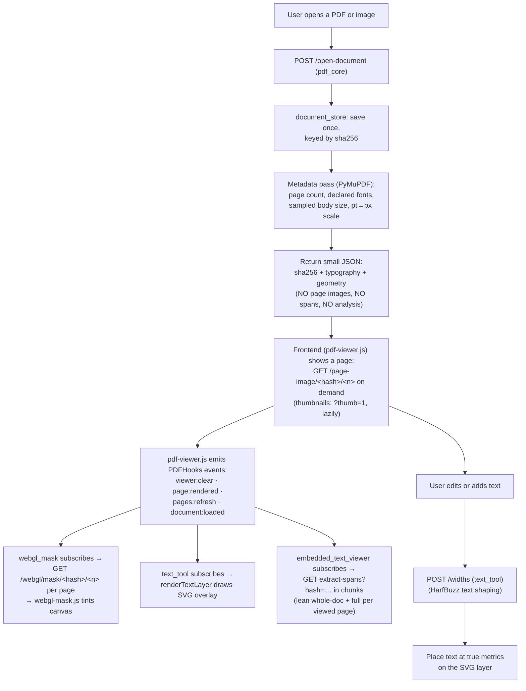
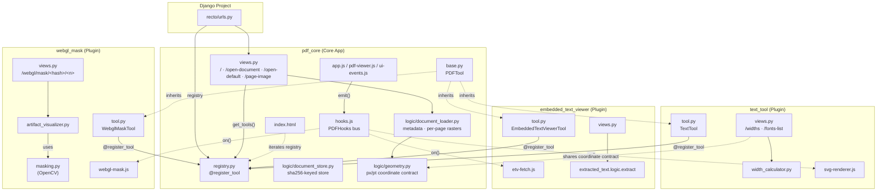

# Recto — Architecture Overview

Recto is an extensible PDF editor built on Django. It opens a PDF or scanned image, renders
its pages, and lets you edit and add text with true font metrics — and everything beyond that
is a plugin.

The project uses a "Core + Plugin" architecture with two complementary registries — a **Python
tool registry** (`@register_tool`) for backend/template wiring and a **JavaScript hook bus**
(`PDFHooks`) for frontend lifecycle wiring — so features live in independent,
individually-removable Django apps.

The dividing line is strict: **the core opens the document and runs no analysis.** It returns
pages, embedded text, and typography, then emits `document:loaded`. Any plugin that wants to
draw a conclusion about the document listens for that event and calls its own endpoint.
`webgl_mask` — which finds the blacked-out regions of a page and tints them on the GPU — is a
plugin like any other, and deleting its folder leaves the core untouched.

## Technology Stack

| Layer | Technology | Purpose |
|-------|-----------|---------|
| **Web framework** | Django 6.0 | URL routing, template rendering, API views |
| **PDF parsing** | PyMuPDF (fitz) | Extract embedded images and text spans from PDFs |
| **Image analysis** | OpenCV + NumPy | Detect black rectangular regions in page images (`webgl_mask`) |
| **Text shaping** | uHarfBuzz (+ Pillow fallback) | Measure precise pixel widths of text accounting for kerning |
| **Mask generation** | Pillow + NumPy | Create grayscale mask PNGs marking regions (`webgl_mask`) |
| **Frontend rendering** | Vanilla JS, Fabric.js, WebGL | PDF page display, SVG text overlays, GPU-accelerated mask tinting |
| **Plugin integration** | `PDFHooks` event bus (JS) + `@register_tool` (Python) | Decoupled, by-event plugin wiring on both ends |
| **Production server** | Gunicorn + Nginx | WSGI app server behind a reverse proxy with SSL |

## Directory Structure

```
recto/
├── manage.py                       # Django entry point
├── requirements.txt                # Python dependencies
├── run_app.bat                     # Local dev launcher (Windows)
│
├── recto/                          # Django project config
│   ├── settings.py                 # INSTALLED_APPS (core + dynamic plugin discovery)
│   ├── urls.py                     # Auto-discovers routes via registry + AppConfig
│   ├── wsgi.py / asgi.py
│
├── pdf_core/                       # Core App (document ingestion + base viewer)
│   ├── base.py                     # PDFTool base class (all plugins inherit from this)
│   ├── registry.py                 # PDFToolRegistry + @register_tool decorator
│   ├── views.py                    # Root /, /open-document, /open-default, /page-image — no analysis
│   ├── urls.py
│   ├── logic/
│   │   ├── document_store.py       # Uploaded docs stored by sha256 (media/doc_cache, LRU)
│   │   ├── document_loader.py      # PDF/image → metadata + per-page rasters on demand
│   │   ├── geometry.py             # The px/pt coordinate contract (single source of truth)
│   │   ├── shaper.py               # HarfBuzz shaping
│   │   ├── layout_calculator.py    # Line layout
│   │   └── line_breaker.py         # Line breaking
│   ├── templates/                  # Base index.html (iterates registry for plugins)
│   └── static/pdf_core/            # Base UI JS: hooks.js (event bus), state.js, pdf-viewer.js,
│                                   #   ui-events.js, app.js, styles.css
│
├── text_tool/                      # Plugin App (Font logic & Typography)
│   ├── tool.py                     # TextTool(PDFTool) — registered via @register_tool
│   ├── apps.py                     # ready() imports tool.py
│   ├── views.py                    # /widths, /fonts-list
│   ├── urls.py
│   ├── logic/
│   │   ├── width_calculator.py     # HarfBuzz width measurement
│   │   └── extract_fonts.py        # Dominant font detection
│   ├── templates/                  # Toolbars injected via registry
│   └── static/text_tool/           # unified-text-box.js, svg-renderer.js, etc.
│
├── webgl_mask/                     # Plugin App (Visual GPU Masks)
│   ├── tool.py                     # WebglMaskTool(PDFTool)
│   ├── apps.py
│   ├── views.py                    # /webgl/mask/<hash>/<n> (+ legacy /webgl/masks)
│   ├── urls.py
│   ├── logic/
│   │   ├── artifact_visualizer.py  # OpenCV -> grayscale mask PNG generator
│   │   └── masking.py              # Mask-array helpers
│   ├── templates/                  # Toolbar button + options bar injected via registry
│   └── static/webgl_mask/          # webgl-mask.js (WebGL renderer), webgl-mask.css
│
├── embedded_text_viewer/           # Plugin App (Self-contained Inline Text Overlay)
│   ├── tool.py                     # EmbeddedTextViewerTool(PDFTool)
│   ├── apps.py
│   ├── views.py                    # /embedded-text-viewer/api/extract-spans
│   ├── urls.py
│   ├── logic/                      # span extraction + width helpers
│   ├── templates/                  # Toolbar link and options bar
│   └── static/embedded_text_viewer/
│       └── etv-fetch.js            # Span fetching & ETV lifecycle (subscribes to PDFHooks)
│
├── extracted_text/                 # Backend-only App (no PDFTool, no UI, no routes)
│   ├── apps.py                     # Pure logic module
│   └── logic/extract.py            # extract_pdf() / extract_spans_range() — imported by embedded_text_viewer.views
│
├── assets/
│   ├── fonts/                      # .ttf font files for width calculation
│   └── pdfs/                       # Startup document — the PDF here auto-loads on open
│
├── guide/                          # Documentation (you are here)
└── db.sqlite3
```

## Two registries, two directions of decoupling

The project keeps the core ignorant of which plugins exist, on **both** ends of the stack:

| Concern | Mechanism | Who registers | Who consumes |
|---------|-----------|---------------|--------------|
| Backend routes, templates, static, toolbar slots | `@register_tool` on a `PDFTool` subclass (`pdf_core/registry.py`) | each plugin's `tool.py` (imported by its `apps.py` `ready()`) | `recto/urls.py` + `index.html` iterate the registry |
| Frontend runtime lifecycle (page render, document load, zoom, …) | `PDFHooks.on(event, handler)` (`pdf_core/static/pdf_core/hooks.js`) | each plugin's JS at load time | the core viewer emits events with `PDFHooks.emit(...)` |

Because the core **emits events** and **iterates a registry** rather than calling plugin code by name, deleting a plugin folder removes the app, its routes, its templates, its static, and its event subscriptions in one step — with no dangling references left in the core. (See the [Tool Expansion Guide](../tool-expansion-guide.md) for the hook bus contract.)

## Data Flow

The core's pass ends the moment the document is on screen. Analysis is a *second*, plugin-owned
pass that hangs off `document:loaded` — which is what makes every analysis feature deletable.



## Module Dependencies



## Optional plugins

The tree above is the **baseline**: the core plus the four plugins that ship with it. Anything
else is optional, documented in [`guide/plugins/`](../plugins/), and referenced nowhere in this
document by design — a baseline doc that named an optional plugin would be a leak.

An optional plugin attaches through exactly two seams, both of which degrade to nothing when
it is absent:

- **The `PDFHooks` bus** — it subscribes to `document:loaded`, re-posts `state.currentFile` to
  its own endpoint, and adds its own boxes or overlays. The core never calls it.
- **Guarded globals** — `text_tool` contains `typeof fn === 'function'` call sites for
  functions no baseline plugin defines. An installed plugin defines them and they light up; with
  none installed they silently no-op.

`UnifiedTextBox` is likewise extensible: a plugin may contribute its own `type` and its own
fields, which sit inert when the plugin is gone. See [Unified Text Box](./unified-text-box.md).

## Frontend plugin integration — the `PDFHooks` bus

`pdf_core/static/pdf_core/hooks.js` defines `window.PDFHooks` (`on` / `off` / `emit`). It is loaded **first**, before any other script. The core viewer emits lifecycle events; plugins subscribe. Handlers may be async (`emit` awaits them in registration order) and a throwing handler never breaks the core or other plugins.

| Event | Emitted by | Payload | Example subscriber |
|-------|-----------|---------|--------------------|
| `ui:ready` | `app.js` (end of init) | — | `webgl_mask` wires its mask-toggle button |
| `viewer:clear` | `pdf-viewer.js` (`goToPage`) | — | `webgl_mask` tears down GL contexts |
| `page:rendered` | `pdf-viewer.js` (`goToPage`) | `{ pageContainer, pageNum }` | `webgl_mask` adds its overlay canvas; `text_tool` draws the SVG layer |
| `pages:refresh` | `pdf-viewer.js` (`goToPage`) | — | `webgl_mask` re-syncs visible mask canvases |
| `document:loaded` | `pdf-viewer.js` (`loadDocument`) | `{ file, isDefault }` | `webgl_mask` fetches masks; `embedded_text_viewer` fetches spans |
| `zoom:changed` | `ui-events.js` (`updateCSSZoom`) | `{ zoom }` | (available for plugins that need zoom-aware redraws) |

The core never calls a plugin function by name and owns no plugin DOM. Plugins that contribute a subtoolbar register their toggle button with `window.registerSubtoolbar(button)` so the generic `openSubtoolbar` can manage it without naming the plugin.
