# Redaction Processing — Backend Logic

This folder documents the core logic modules distributed across the **pdf_core**, **webgl_mask**, and **text_tool** Django apps.

## Module Pipeline

```mermaid
flowchart TD
    subgraph pdf_core
        PR["detect"]
        BD["BoxDetector"]
        SW["SurroundingWordWidth"]
    end
    
    subgraph webgl_mask
        AV["artifact_visualizer"]
    end
    
    subgraph text_tool
        WC["width_calculator"]
        EF["extract_fonts"]
    end

    PDF["PDF Bytes"] --> PR
    PR --> BD
    PR --> SW
    
    PDF --> AV
    AV -.->|"depends on core logic"| BD
    
    EF -.- PR
    
    style PR fill:#2d333b,stroke:#81c995
    style BD fill:#2d333b,stroke:#8ab4f8
    style SW fill:#2d333b,stroke:#f28b82
    style AV fill:#2d333b,stroke:#fdd663
    style WC fill:#2d333b,stroke:#c58af9
    style EF fill:#2d333b,stroke:#c58af9
```

## Module Reference

| App | Module | Description |
|-----|--------|-------------|
| **pdf_core** | [BoxDetector](boxdetector.md) | Row-scan detection of black rectangular boxes |
| **pdf_core** | [SurroundingWordWidth](surrounding-word-width.md) | Refine box edges using positions of nearby words |
| **pdf_core** | [detect](process-redactions-docs.md) | Orchestrator: coordinates detection + refinement |
| **webgl_mask** | [artifact_visualizer](artifact-visualizer-documentation.md) | Async generation of grayscale mask PNGs |
| **text_tool** | [width_calculator](width-calculator-documentation.md)| HarfBuzz text shaping for width measurement |
| **text_tool** | [extract_fonts](extract-fonts.md) | Dominant font detection and mapping |

## Processing Order

1. **Receive** PDF or image bytes from the Django view
2. **Extract** embedded page images from PDF using PyMuPDF (`extract_page_image_bytes`)
3. **Detect** black rectangular boxes in each image (`BoxDetector`)
4. **Refine** box edges by measuring gaps to surrounding text words (`SurroundingWordWidth`)
5. **Return** structured JSON with redaction coordinates, text spans, and base64 page images
6. **On demand:** Generate grayscale mask PNGs for individual pages (`artifact_visualizer`)
7. **On demand:** Measure pixel widths of candidate names using HarfBuzz (`width_calculator`)
